# Veterinary Medical Records

A system for intelligent processing system for veterinary medical records.

## Table of Contents

- [Architecture](#architecture)
  - [Diagram](#diagram)
  - [Database model](#database-model)
  - [API endpoints](#api-endpoints)
- [How The Structured Info Supports Claim Adjudication (Core of the Problem)](#how-the-structured-info-supports-claim-adjudication-core-of-the-problem)
  - [(A) Pre-existing Condition Evaluation](#a-pre-existing-condition-evaluation)
  - [(B) Waiting Period Evaluation](#b-waiting-period-evaluation)
  - [(C) Invoice Line Approval/Rejection](#c-invoice-line-approvalrejection)
- [Metrics](#metrics)
- [Assumptions & Design Decisions](#assumptions--design-decisions)
- [Future improvements](#future-improvements)
- [Iterative and incremental approach](#iterative-and-incremental-approach)
  - [Iteration 0 - Frontend skeleton + fake Data and meaningful placeholders](#iteration-0---frontend-skeleton--fake-data-and-meaningful-placeholders)
  - [Iteration 1 – Real File Upload + Basic Preview](#iteration-1--real-file-upload--basic-preview)
  - [Iteration 2 – Extraction Flow (With Mock API First), file can be uploaded but when processed mock data is returned](#iteration-2--extraction-flow-with-mock-api-first-file-can-be-uploaded-but-when-processed-mock-data-is-returned)
  - [Iteration 3 – Wire to Real Backend API to extract text](#iteration-3--wire-to-real-backend-api-to-extract-text)
  - [Iteration 4 – Wire structured info service on API to extract that info given the extracted text from the document](#iteration-4--wire-structured-info-service-on-api-to-extract-that-info-given-the-extracted-text-from-the-document)
  - [Iteration 5 – Save extracted text and structured info in DB and add endpoint to list processed documents](#iteration-5--save-extracted-text-and-structured-info-in-db-and-add-endpoint-to-list-processed-documents)
  - [Iteration 6 - Make the sections in Structure Info foldable for better UX for vet team](#iteration-6---make-the-sections-in-structure-info-foldable-for-better-ux-for-vet-team)
  - [Iteration 7 - Modify process endpoint to return URL to poll, add endpoint to poll on a run and Celery worker to defer the task of processing a document](#iteration-7---modify-process-endpoint-to-return-url-to-poll-add-endpoint-to-poll-on-a-run-and-celery-worker-to-defer-the-task-of-processing-a-document)
- [Development](#development)
  - [Prerequisites](#prerequisites)
  - [Setup](#setup)

## Architecture

- **Frontend**: ReactJS with TypeScript and Vite for tooling
- **Backend**: FastAPI (Python) with SQLModel/SQLAlchemy for database operations and PostgreSQL as database
- **AI Processing**: OpenAI GPT-4o-mini for extraction of structured information from extracted text
- **Containerization**: Docker Compose for local development

### Diagram

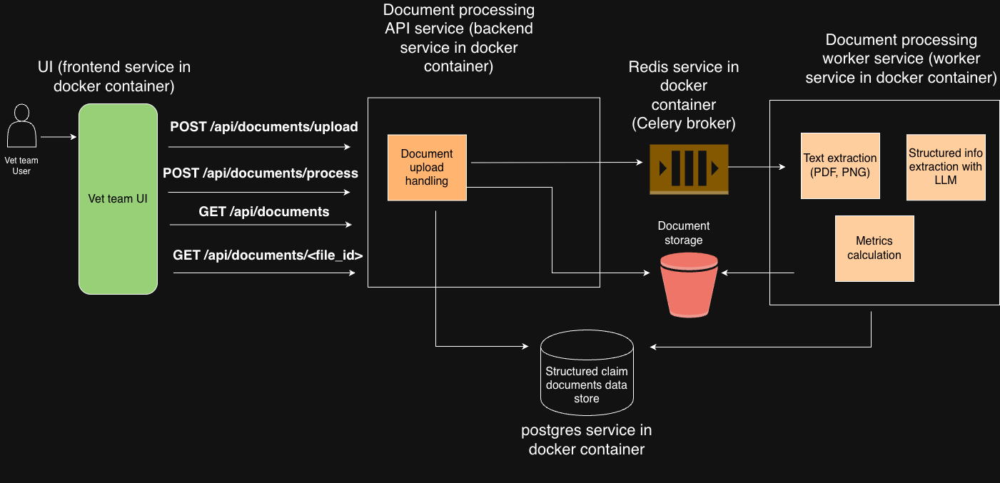

### Database model

The database consists of two main tables that track document processing runs and their associated metrics.

#### `document_processing_runs`

Represents a single processing run of a veterinary medical record document. A document file can be processed multiple times, each creating a new processing run with potentially different extracted text and structured data.

| Field | Type | Description |
|-------|------|-------------|
| `id` | `string` (UUID) | Primary key. Unique identifier for the processing run. |
| `filename` | `string` | Original filename of the uploaded document. |
| `document_type` | `string` | File extension/type (e.g., `.pdf`, `.docx`, `.png`). |
| `file_path` | `string` (nullable) | Path to the stored file on disk. |
| `extracted_text` | `text` (nullable) | Raw text extracted from the document using OCR or PDF parsing. |
| `structured_data` | `json` (nullable) | Structured medical record data extracted by the LLM, containing pet information, diagnoses, procedures, medications, etc. |
| `created_at` | `datetime` | Timestamp when the processing run was created (document upload). |
| `updated_at` | `datetime` | Timestamp when the processing run was last updated (after processing completes). |

**Key Points:**
- The same document file can be uploaded and processed multiple times, creating separate processing runs.
- `extracted_text` and `structured_data` are `NULL` until the document is processed via the `/api/documents/process` endpoint.
- The `status` of a processing run can be inferred: `"uploaded"` if `extracted_text` is `NULL`, `"processed"` otherwise.

#### `document_processing_run_metrics`

Stores performance and quality metrics for each document processing run, enabling cost-benefit analysis and quality monitoring.

| Field | Type | Description |
|-------|------|-------------|
| `id` | `string` (UUID) | Primary key. Unique identifier for the metrics record. |
| `document_id` | `string` (UUID) | Foreign key to `document_processing_runs.id`. Indexed for efficient lookups. |
| `extraction_completeness_pct` | `float` (nullable) | Text extraction completeness percentage. Calculated based on extracted text length vs. file size. |
| `field_fill_rate` | `float` (nullable) | Field fill rate as a percentage (filled_fields / total_expected_fields × 100). Measures how many structured data fields were successfully populated. |
| `filled_fields_count` | `int` (nullable) | Absolute count of filled fields in the structured data. Used for cost-per-field calculations. |
| `llm_token_cost` | `float` (nullable) | Total LLM token cost in USD for this processing run. |
| `prompt_tokens` | `int` (nullable) | Number of prompt tokens consumed by the LLM. |
| `completion_tokens` | `int` (nullable) | Number of completion tokens generated by the LLM. |
| `total_tokens` | `int` (nullable) | Total tokens used (prompt_tokens + completion_tokens). |
| `created_at` | `datetime` | Timestamp when the metrics record was created. |

**Key Points:**
- One-to-one relationship: Each processing run has exactly one metrics record (created after processing completes).
- Metrics are only populated when LLM processing occurs (all token-related fields are `NULL` if processing fails or uses fallback).
- `field_fill_rate` and `filled_fields_count` enable cost-benefit analysis (e.g., `llm_token_cost / field_fill_rate` for cost per completeness unit).

- Each `document_processing_run_metrics` record references exactly one `document_processing_runs` record via `document_id`.
- The relationship is one-to-one: a processing run has one metrics record, and a metrics record belongs to one processing run.


### API endpoints
- /api/document/upload: accepts POST to upload a document
- /api/document/process: accepts POST to process a document given the file_id given in the `upload` operation
- /api/document: accepts GET to list all documents processing runs including the name of the document.
- /api/document/<document_file_id>: accepts GET to retrieve the result (extracted_text and structured_data) of a document processing run
- /api/document/<document_file_id>/status: accepts GET to retrieve the status of a document processing run

## How The Structured Info Supports Claim Adjudication (Core of the Problem)

The structured medical record is intentionally designed to support these downstream decisions.
The extracted data structure addresses three critical areas of claim adjudication:

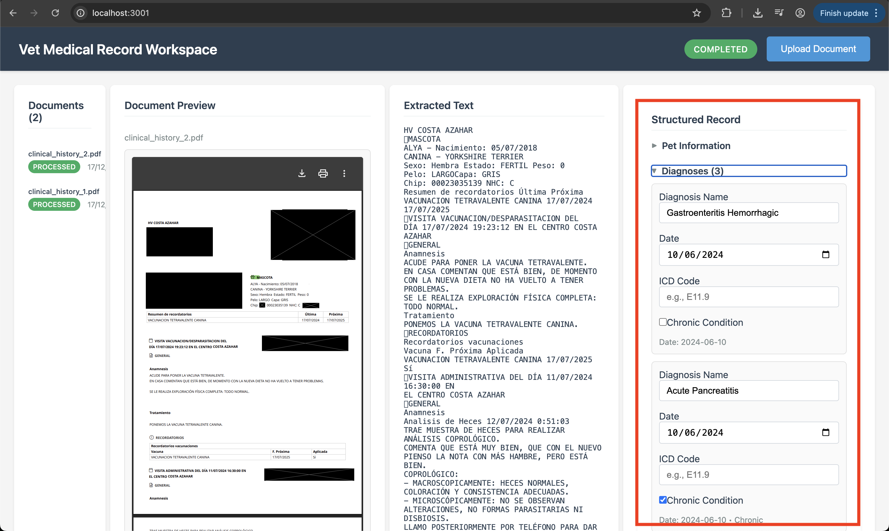
<br>

### (A) Pre-existing Condition Evaluation

The system extracts and structures data needed to determine pre-existing conditions:

- **Pet Diagnoses**: Multiple diagnoses with dates, ICD codes, and chronic condition flags
- **Past Medical Issues**: Historical medical problems extracted from notes
- **Chronic Conditions**: Conditions identified as chronic from clinical notes
- **Dates of Diagnoses/Procedures**: Critical for comparing diagnosis date vs. policy start date
- **Medication History**: Medications with start/end dates to track treatment history

**Usage**: A pre-existing condition is determined by comparing diagnosis date vs. policy start date.
If a diagnosis occurred before the policy start date, it may be considered pre-existing and excluded from coverage.

### (B) Waiting Period Evaluation

The system captures data needed to evaluate waiting periods:

- **Procedure Date**: Date when surgery, test, or treatment was performed
- **Symptom Onset Date**: When symptoms first appeared (if extractable from the document)
- **Diagnosis Date**: When the condition was diagnosed

**Usage**: Waiting period logic typically depends on procedure date. If
`procedure_date < policy_start_date + waiting_period`, the claim may be rejected. For example,
if a policy has a 14-day waiting period for surgeries and a procedure was performed 10 days after policy start, it would be rejected.

### (C) Invoice Line Approval/Rejection

For each procedure, test, or medication in the medical record, the system extracts:

- **Procedure/Test Performed**: Name of the procedure with CPT codes
- **Medication Prescribed**: Medication name with dosage and frequency
- **Related Diagnosis**: Which diagnosis the procedure/medication addresses
- **Cost**: Procedure cost if included in the document
- **CPT/ICD Codes**: Standardized codes for procedure and diagnosis matching
- **Reason for Procedure**: Clinical justification
- **Clinic Information**: Clinic name, address, veterinarian for verification

**Usage**: This structured data maps directly to claim engine matching that decides if the whole invoice or only
some invoice lines are approved:

| Structured Field | Used to Compare With... |
|-----------------|-------------------------|
| Procedure name | Policy coverage table |
| Diagnosis | Exclusions & pre-existing rules |
| Procedure date | Waiting periods |
| Medication | Exclusions & limitations |
| Cost | Coverage limits, copay rules |
| CPT/ICD codes | Policy coverage and fee schedules |

## Metrics

- Some metrics to determine the success of the document processing were implemented:
  - field_fill_rate: Schema/output completeness (how many of the expected schema fields were filled, checking for non-empty)
  - prompt_tokens/completion_tokens: LLM input/output tokens
  - llm_token_cost: Input/output LLM token cost
  - extraction_completeness_pct: Text extraction completeness percentage (length of text extracted / original file size)

- The metric extracted_field_efficiency (llm_token_cost / filled_fields_count) is already being calculated and stored in
the metrics table which represents a metric of cost-benefit of the extraction

- Metrics that could be added in the future that would indicate how to prioritize improvements:
  - Granularity per section in the structured info (the success and quality of the extraction for certain
  sections: diagnosis, procedures, medications)
  - Cost per field extracted

```SQL
veterinary_db=# select * from document_processing_run_metrics;
                  id                  |     document_processing_runs_id      | extraction_completeness_pct | field_fill_rate | filled_fields_count | extracted_field_efficiency |    llm_token_cost     | prompt_tokens | completion_tokens | total_tokens | document_run_processing_time |         created_at
--------------------------------------+--------------------------------------+-----------------------------+-----------------+---------------------+----------------------------+-----------------------+---------------+-------------------+--------------+------------------------------+----------------------------
 148d858b-c34d-4d40-a711-9499f87fac50 | d70ed88b-6c1a-4ca1-8738-5536d5c8fce0 |            8.94178354358119 |             100 |                  12 |               0.0001012125 |            0.00121455 |          4833 |               816 |         5649 |           20.251506805419922 | 2025-12-17 06:07:50.14882
 0c378e3f-39f7-4797-849b-aa150c29c6ae | 3026a14e-e568-4ae9-af0b-c59a6e187cb9 |           4.237671881589226 |             100 |                  12 |     0.00016699999999999997 | 0.0020039999999999997 |         10184 |               794 |        10978 |           18.009423971176147 | 2025-12-17 06:12:29.630394
(2 rows)
```

## Assumptions & Design Decisions

- **Monorepo Structure**: Chose monorepo with Docker Compose for convenient local development
- **File Storage**: Local file storage is used for development; in production, S3 or similar would be used. Abstraction added around storage.
- **Text Extraction**: Started with pypdf for PDF and pytesseract/PIL with OCR for images
- **Document List API**: The vet team cares about a document they uploaded regardless if it has been uploaded/processed several times
so the document list operation returns the latest processing run for that document, it was naively assumed the name of the file
will be unique, using a better mechanism based on hashing part of the document content to know if a file uploaded had already been uploaded before, would be more solid
- **Symptom onset date**: it was assumed that LLM would extract only one date and reflected in the system prompt, there can
be more than one symptom so this approach has limitations

## Future improvements

- Text extraction:
  - Properly test certain image files like JPEG 
  - It will be extended to Word documents (doc, docx)
- Token-based user authentication stored in secure cookies
- Statically serve original file for the document preview from the backend for local (and in production from S3)
- Add more tests both in backend and frontend
- Add evals for the LLM generation, those evals could be:
  - Field extraction accuracy: Compare extracted values against ground truth annotations (done manually by vet team) to measure correctness.
  - Date parsing accuracy: Verify dates are correctly extracted and formatted (ISO format, logical ordering).
  - Medical code accuracy: Validate ICD/CPT codes match the diagnoses/procedures mentioned in the document.
  - Hallucination detection: Flag when the LLM adds information not present in the source text.
  - Field coverage: Measure the percentage of available information in the source text that was
  successfully extracted. Requires ground truth or manual annotation of what was in the source document.
  - Critical field detection: Flag when important fields (diagnosis, medications) are missing when they should be present.
  - Cross-field consistency: Verify medication dates align with visit dates, procedures match diagnoses, and entities are consistent.
  - Schema compliance: Ensure output matches the expected JSON schema structure and data types.
  - Insurance claim readiness: Verify all required fields for claim adjudication are present and correctly formatted.
  - Token efficiency: Track cost per successfully extracted field to evaluate model cost-effectiveness.
- Based on the eval `Hallucination detection` mentioned above, consider if guardrails in the prompts are needed since there are none at the moment.
- Events could be emitted along the medical record processing for consumers to receive them, some of those events could be:
  - medical_record_processed: the event payload could include document_processing_run_id

## Iterative and incremental approach

### Iteration 0 - Frontend skeleton + fake Data and meaningful placeholders

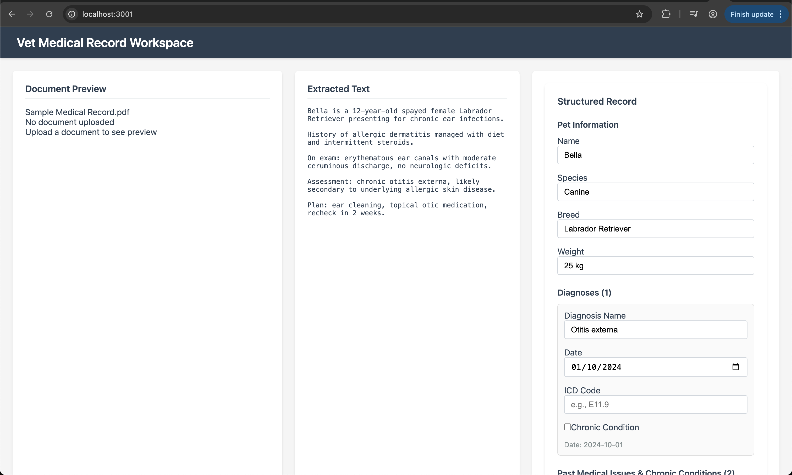

### Iteration 1 – Real File Upload + Basic Preview

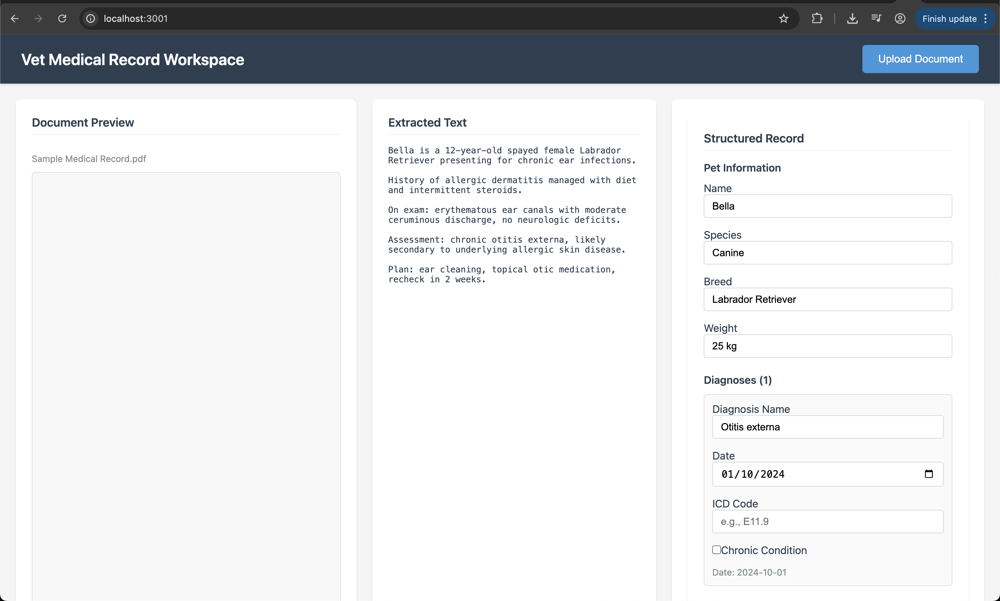
<br>
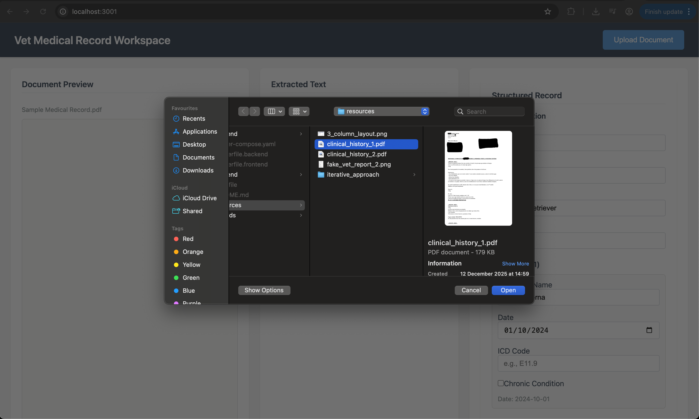
<br>
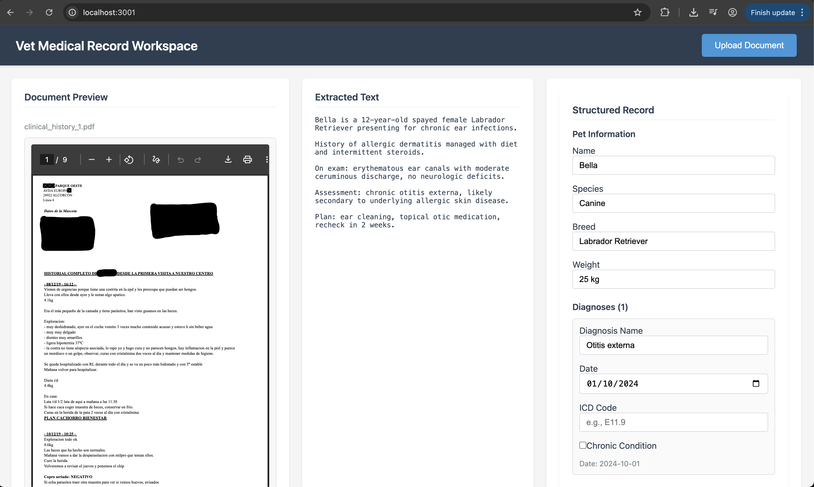

### Iteration 2 – Extraction Flow (With Mock API First), file can be uploaded but when processed mock data is returned

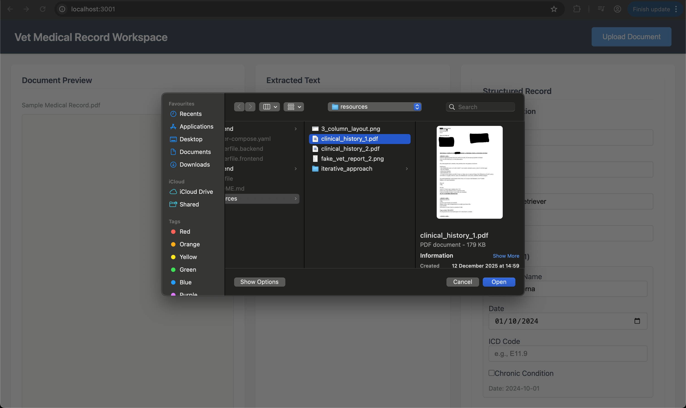
<br>
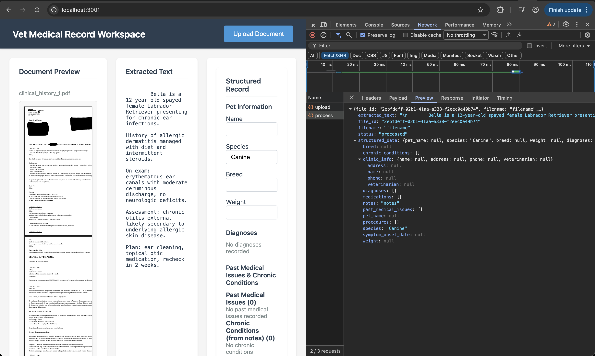
<br>

<br>
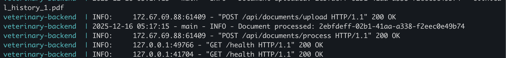
<br>

### Iteration 3 – Wire to Real Backend API to extract text

  - PDF document file type

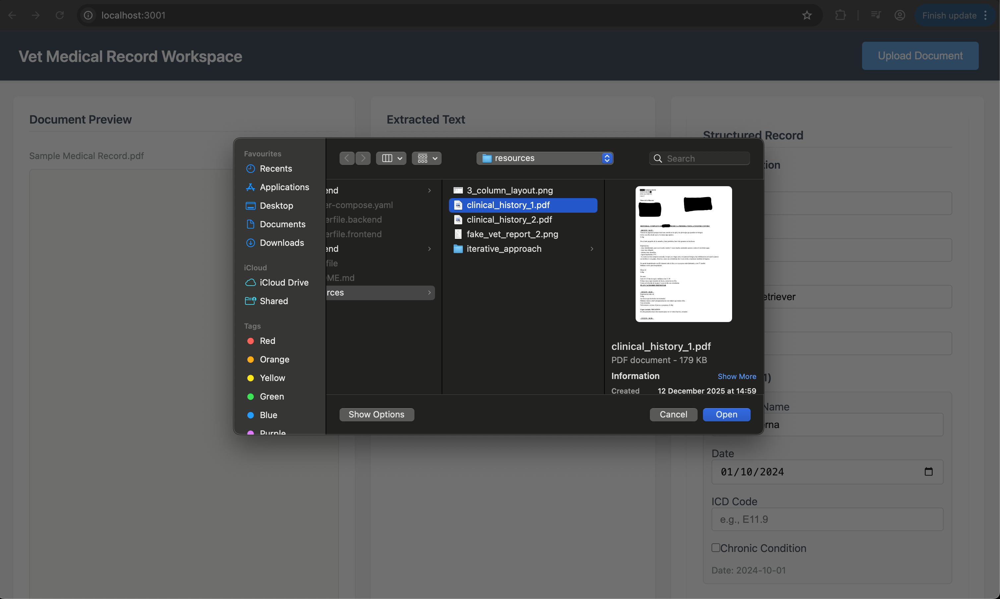
<br>
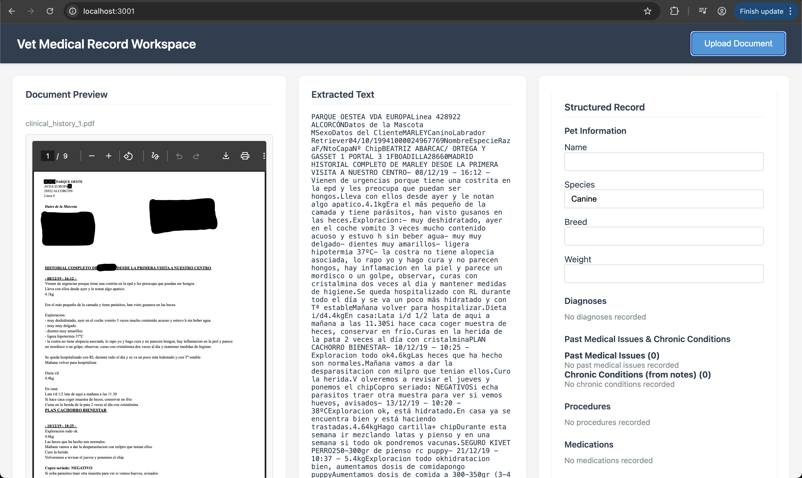
<br>

  - PNG document file type

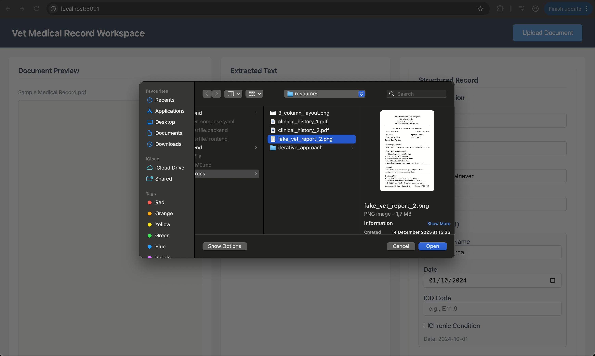
<br>
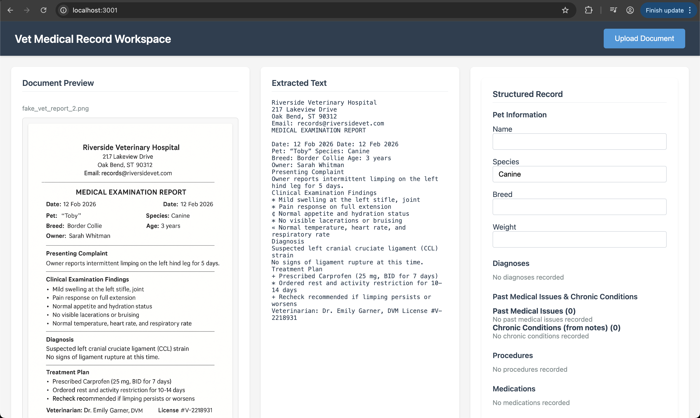
<br>

### Iteration 4 – Wire structured info service on API to extract that info given the extracted text from the document 

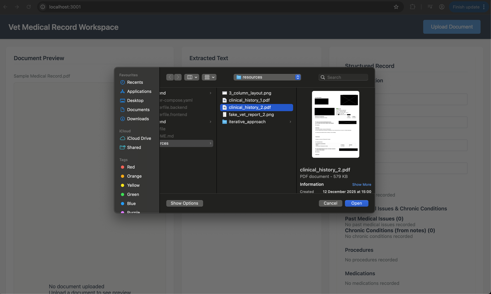
<br>
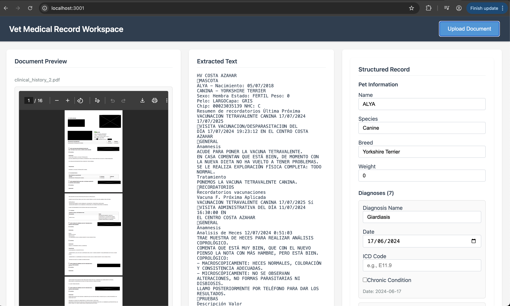
<br>

  - Add document processing status since to mitigate the UX for long documents

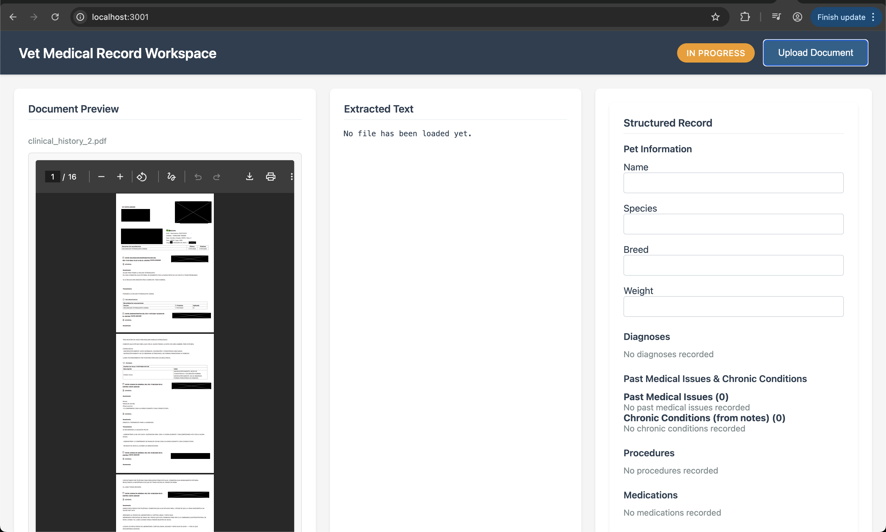
<br>
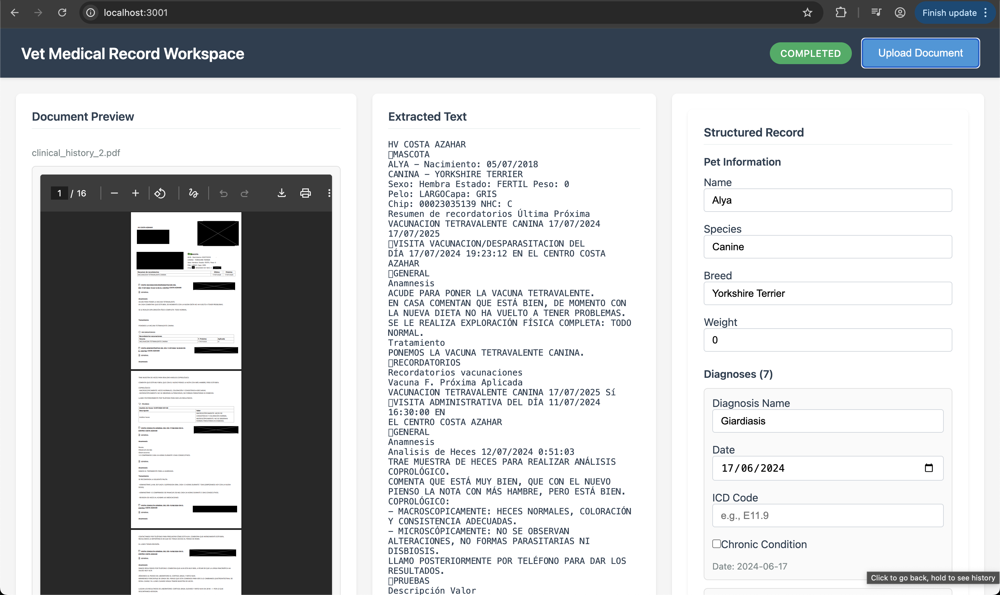
<br>

### Iteration 5 – Save extracted text and structured info in DB and add endpoint to list processed documents

Note: a user can continue reviewing a document without processing it again after this iteration. Also see that the
extracted data and structured info can be returned by the backend but not the original document which was left
as future improvement

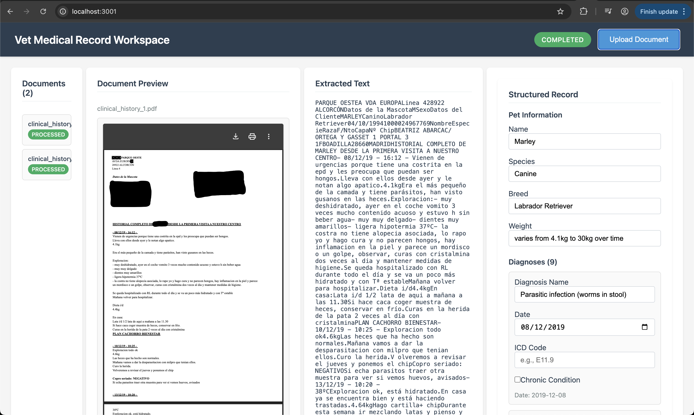
<br>

<br>

### Iteration 6 - Make the sections in Structure Info foldable for better UX for vet team

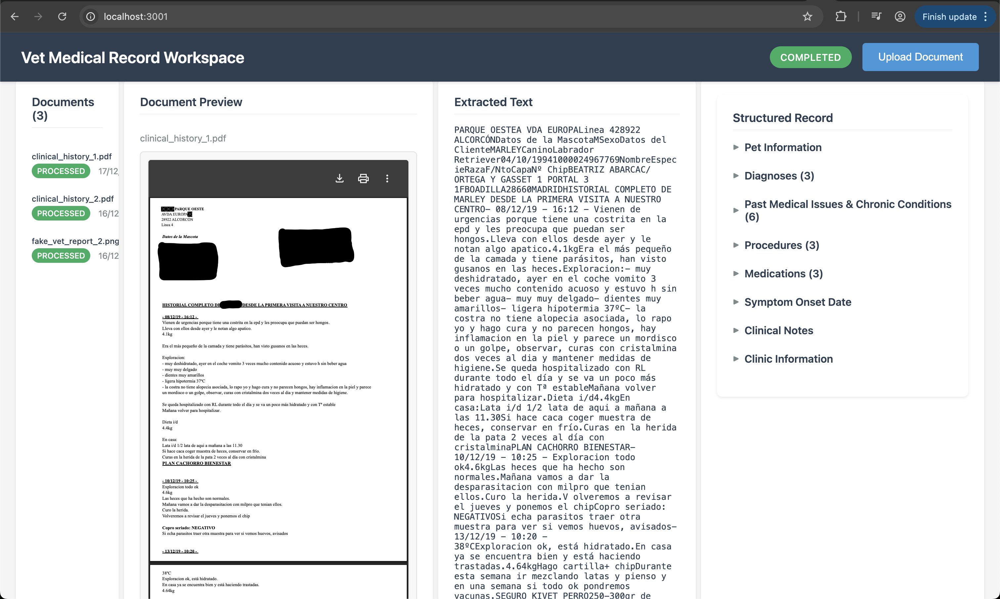
<br>
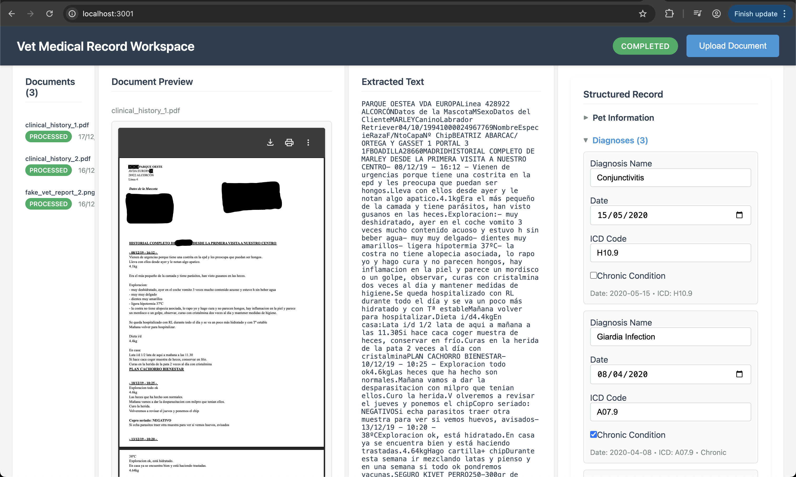
<br>

### Iteration 7 - Modify process endpoint to return URL to poll, add endpoint to poll on a run and Celery worker to defer the task of processing a document

## Development

### Prerequisites

- Docker, Docker Compose, and OpenAI API key set in OPENAI_API_KEY variable in .env.local

### Setup

1. Clone the repository
2. Run `make create-dev` to start backend and frontend services
3. Access the frontend at http://localhost:3001
4. You can check the backend is running at http://localhost:8000
5. Run `make logs` to see logs of all services
6. Run `make down` to stop all services

- Run tests
  - Backend: `make backend-test`
  - Frontend: `make frontend-test`

- Other tooling
  - Run `make fix` to fix code format using `ruff`
  - DB schema migrations can be to handle schema changes, migrations can be run with `make migrate` 
